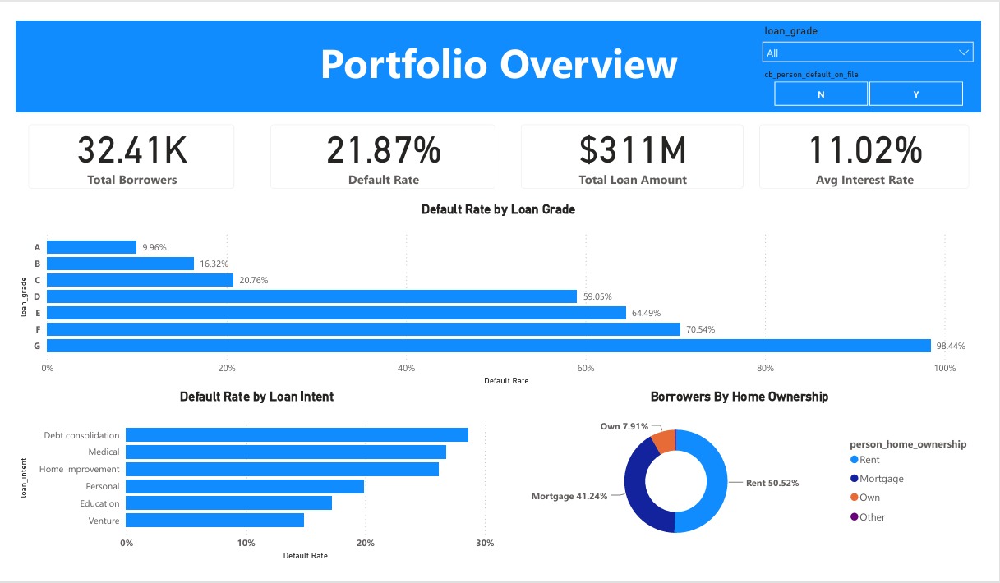

# Credit Risk Analysis

An end-to-end credit risk analysis project transforming raw loan applicant data into an actionable, interactive Power BI dashboard, powered by SQL data pipelines, Star Schema dimensional modeling, and DAX metrics.

## Overview

This project analyzes a simulated credit bureau dataset to assess loan default risk. The workflow covers the full analytics pipeline: raw data cleaning and validation in MySQL, dimensional modeling in Power Query, and a 3-page interactive dashboard built with DAX measures to support underwriting and risk pricing decisions.

## Tools Used

- **MySQL** — data staging, cleaning, and exploratory analysis
- **Power Query (M)** — dimensional modeling
- **Power BI / DAX** — data modeling, measures, and dashboard visuals

## Project Workflow

1. **Data Cleaning (SQL)** — staged the raw dataset, removed duplicate records, standardized inconsistent text values (loan intent, home ownership categories), handled missing values (median/group-average imputation for interest rate, row removal for employment length), and removed logically impossible records (unrealistic ages, employment lengths exceeding 45 years).
2. **Exploratory Data Analysis (SQL)** — analyzed portfolio volume, interest rate patterns by loan grade and intent, and default rate behavior across previous default history, debt-to-income levels, age groups, loan grade, and loan intent.
3. **Data Modeling (Power BI)** — decomposed the cleaned dataset into a Star Schema with one fact table (`fact`) and two dimension tables (`dim person`, `dim loan`) for optimal DAX performance.
4. **Dashboard Design (Power BI)** — built a 3-page interactive report covering portfolio overview, risk driver diagnostics, and underwriting strategy insights.

## Dashboard Preview

### Portfolio Overview


### Risk & Default Drivers


### Underwriting & Risk Pricing Strategy


## Data Model

The dashboard is built on a Star Schema with one fact table (`fact`) and two dimension tables (`dim person` for borrower demographics and `dim loan` for loan attributes), designed for optimal DAX performance.

📄 [View full data model documentation](docs/data_model.md)

## Key Insights

- Analyzed **32,409** cleaned loan records with an overall default rate of **21.87%** and a total loan portfolio value of **$311M**
- **Loan grade is a strong predictor of default risk**: default rate rises sharply from **9.96%** for Grade A to **98.44%** for Grade G, confirming the underwriting grading system aligns closely with actual outcomes
- Borrowers with a **prior default on file** default at more than **double the rate** (37.86%) of those without one (18.44%)
- Default rate climbs sharply as **debt-to-income (DTI)** increases: from **13.56%** in the 0–20% bracket to **40.53%** in the 21–40% bracket
- The **19–40 age group** makes up the vast majority of the portfolio (95.41%) and drives most of the overall default volume
- **Debt consolidation** loans carry the highest default rate among all loan intents, while **Rent** is the most common home ownership status among borrowers (50.52%)

## Repository Structure

```
credit-risk-analysis/
├── data/           # Raw and cleaned datasets
├── sql/            # Data cleaning and EDA scripts
├── power_bi/       # Power BI dashboard file (.pbix)
├── assets/         # Dashboard screenshots and model diagram
├── docs/           # Extended documentation (data model)
└── README.md
```

## License

This project is licensed under the Apache License 2.0 — see the [LICENSE](LICENSE) file for details.
